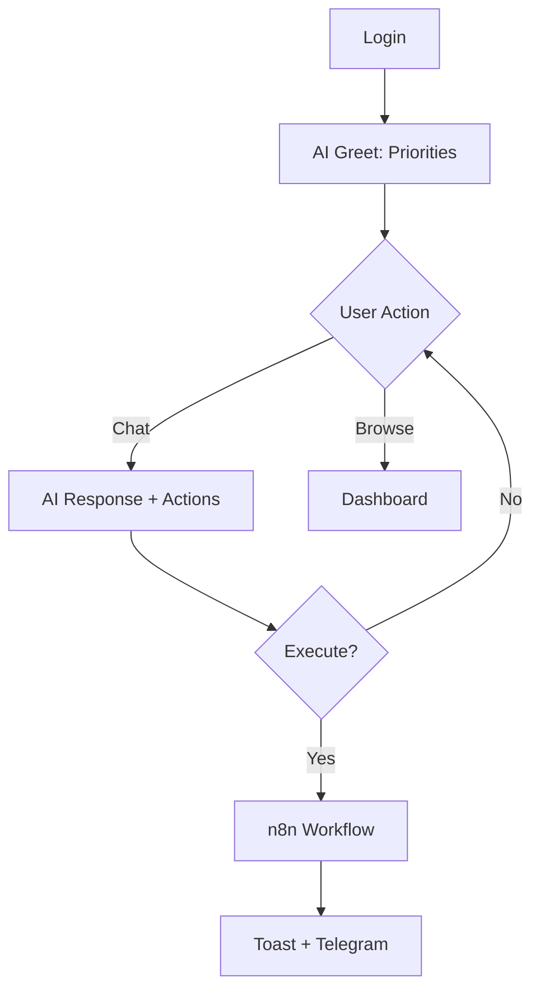
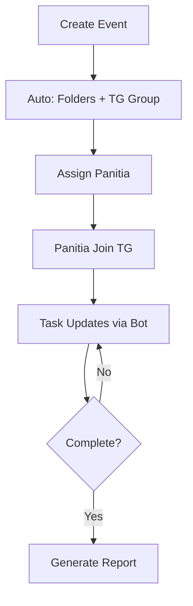
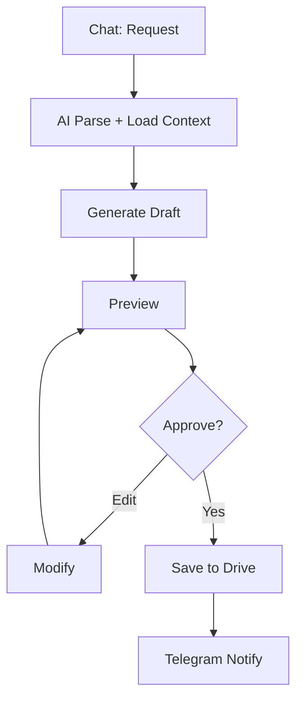

# UX Design Specification: system SWI

**Author:** Iman
**Date:** 2026-01-08

---

<!-- UX design content will be appended sequentially through collaborative workflow steps -->

## Executive Summary

### Project Vision

**system SWI** adalah AI-first operational hub untuk internal bisnis parfum dengan dual-layer architecture:
- **Public Layer:** Company profile website dengan auto-sync content dari backend
- **Authenticated Workspace:** Internal operational hub dengan dashboard interaktif, AI chat, dan Event CDE

**Core Value:** Dokumentasi lengkap dan terpusat, dengan AI sebagai primary interface untuk semua operasi.

### Target Users

| User Type | Role | Access Level | Primary Device |
|-----------|------|--------------|----------------|
| CEO (Beriman) | Strategic oversight | Full access | Desktop |
| COO (Wapiq) | Operations | Full access | Desktop |
| Komisaris | Oversight | View-only | Desktop |
| Panitia Event | Execution | Event-specific | Mobile/Desktop |
| Freelancer | Support | Data-specific | Desktop |
| Public Visitor | Discovery | Public only | Mobile-first |

### Key Design Challenges

1. **Dual-layer navigation** — Seamless transition public↔workspace
2. **Role-based experiences** — Different views untuk setiap role
3. **AI Chat UX** — Membuat conversational automation intuitive
4. **Event CDE complexity** — Full lifecycle management
5. **Responsive priorities** — Mobile-first public, desktop-first workspace

### Design Opportunities

1. **Dashboard personalization** — Role-specific information architecture
2. **AI as command center** — Unified conversational interface
3. **Progressive disclosure** — Simple surface, power underneath
4. **Telegram approval flow** — Seamless mobile approvals

---

## Core User Experience

### Defining Experience

**Primary User Actions by Role:**

| Role | Core Action | Frequency |
|------|-------------|------------|
| CEO/COO | Chat dengan AI untuk priorities & workflows | Daily |
| Panitia | Update progress via Telegram grup | Per task |
| Komisaris | View reports & dashboards | Weekly/Monthly |
| Public | Browse company profile & events | On demand |

**The "Aha!" Moment:** AI memberikan prioritas harian yang actionable dalam <5 detik pertama setelah login.

### Platform Strategy

| Layer | Platform | Rendering | Primary Device |
|-------|----------|-----------|----------------|
| Public | Web MPA | SSR (SEO) | Mobile-first |
| Workspace | Web SPA-like | CSR | Desktop-first |
| Panitia Collab | Telegram Group + Bot | N/A | Mobile |
| Approvals | Telegram Bot | N/A | Mobile |

**Telegram Group Integration:**
- Setiap event memiliki dedicated Telegram group
- Bot di-invite sebagai assistant
- Panitia interact langsung di grup familiar

### Effortless Interactions

| Interaction | How It's Effortless |
|-------------|----------------------|
| Daily priorities | AI auto-generate, no manual checking |
| Document generation | Template + context = ready doc |
| Event task updates | Reply di Telegram grup, auto-sync ke web |
| Approvals | Telegram notification → Confirm button |
| File upload | Panitia send file di grup → Bot handles |

### Telegram Group UX (Panitia)

**Bot Commands:**
- `/status` — Show event progress
- `/mytasks` — Personal task list
- `/upload` — Get upload link
- `/deadline` — Upcoming deadlines

**Passive Notifications:**
- Task assigned → Bot announce
- File uploaded → Bot confirm
- Deadline approaching → Bot remind
- Progress milestone → Bot celebrate 🎉

### Critical Success Moments

| Moment | Success Criteria |
|--------|-------------------|
| First login | Dashboard informatif dalam 3 detik |
| First AI chat | Accurate, actionable response |
| First event creation | Auto-folder, auto-grup Telegram |
| First panitia interaction | Bot respond di grup |

### Experience Principles

1. **AI-First:** Semua dimulai dari conversation, bukan form
2. **Meet Users Where They Are:** Telegram untuk panitia, Web untuk tim inti
3. **Visibility:** Semua progress visible, transparency tinggi
4. **Zero Training:** Intuitif, HELP contextual available

---

## Desired Emotional Response

### Primary Emotional Goals

| User Type | Primary Emotion | Supporting Emotion |
|-----------|-----------------|--------------------|
| CEO/COO | **Empowered** | Confident, In Control |
| Panitia | **Connected** | Belonging, Supported |
| Komisaris | **Informed** | Reassured, Trusting |
| Public | **Impressed** | Curious, Engaged |

### Emotional Journey Mapping

| Stage | Desired Emotion | UX Support |
|-------|-----------------|-------------|
| First Discovery | "Ini yang kita butuhkan!" | Clear value proposition |
| Onboarding | Confident, not overwhelmed | Progressive disclosure |
| Core Action | "Gampang banget!" | Minimal friction |
| Task Completion | Accomplished, satisfied | Visual confirmation |
| Error State | Calm, guided | Clear error messages |
| Return Visit | "Langsung ke intinya" | Remember context |

### Micro-Emotions

**Cultivate:**
- ✅ Confidence — Clear feedback, predictable behavior
- ✅ Trust — Transparent AI, audit logs
- ✅ Accomplishment — Progress indicators, celebrations
- ✅ Belonging — Telegram group, shared visibility

**Prevent:**
- ❌ Confusion — HELP contextual, simple UI
- ❌ Frustration — Fast response, fallback options
- ❌ Isolation — Group updates, notifications
- ❌ Anxiety — Clear status, confirmations

### Design Implications

| Emotion | Design Approach |
|---------|------------------|
| Empowered | AI suggestions, not commands |
| Connected | Real-time group notifications |
| Informed | Dashboard clarity, data viz |
| Confident | Consistent patterns, no surprises |
| Accomplished | 🎉 Celebrations, progress tracking |

### Emotional Design Principles

1. **Show, Don't Tell** — Visual progress > text descriptions
2. **Celebrate Wins** — Mark milestones, acknowledge completion
3. **Soften Errors** — Friendly tone, clear next steps
4. **Build Trust Gradually** — Show AI reasoning, allow override

---

## UX Pattern Analysis & Inspiration

### Inspiring Products Analysis

**1. Telegram**
- **Core Strength:** Familiar, instant messaging, group collaboration
- **Best UX Pattern:** Bot integration dalam grup chat biasa
- **What to Adopt:** Conversational interface, inline buttons, notifications

**2. Google Drive**
- **Core Strength:** Reliable storage, familiar interface
- **Best UX Pattern:** Folder hierarchy, real-time sync
- **AI Memory Pattern:** Store conversation logs untuk context persistence

**3. OpenRouter (Conversational AI)**
- **Core Strength:** Multi-model AI, flexible responses
- **Best UX Pattern:** Natural language understanding, context awareness
- **What to Adopt:** Chat-first interface, AI as primary interaction

**4. n8n (Backend Automation)**
- **Core Strength:** Visual workflow automation, webhook triggers
- **Best UX Pattern:** Event-driven automation, invisible backend
- **What to Adopt:** User tidak tahu ada n8n, just works

### Transferable UX Patterns

| Source | Pattern | Application |
|--------|---------|--------------|
| Telegram | Group + Bot | Event panitia collaboration |
| Telegram | Inline buttons | Quick approvals/confirmations |
| Drive | Folder structure | Auto-generate event folders |
| Drive | Conversation Logs | AI memory persistence |
| OpenRouter | Chat interface | Primary interaction mode |
| n8n | Webhook triggers | Event-driven automation |
| n8n | Background jobs | Invisible orchestration |

### AI Memory Pattern (Drive Logs)

```
User Chat → AI Response → Log to Drive → Next Session → Load Context
```

**Benefits:** AI tidak lupa, audit trail, searchable history, cross-session continuity.

### Architecture Pattern (UX Perspective)

```
User Input (Telegram/Web) → n8n Webhook → Orchestrate (AI/Drive/Telegram) → Response
```

**UX Benefit:** User hanya lihat hasil, tidak perlu tahu kompleksitas backend.

### Anti-Patterns to Avoid

| Anti-Pattern | Why Avoid |
|--------------|-----------|
| Complex forms | Users prefer chat-based input |
| Too many clicks | Use Telegram inline buttons |
| Session amnesia | Store context in Drive |
| Visible complexity | Hide backend orchestration |

### Design Inspiration Strategy

**Adopt:** Telegram group+bot, Drive as truth, Chat-first, Drive AI logs
**Adapt:** Web dashboard for overview, role-based views
**Avoid:** Heavy desktop-only, complex forms, AI without memory

---

## Design System Foundation

### Design System Choice

**Selected:** Tailwind CSS + shadcn/ui

| Component | Technology |
|-----------|------------|
| CSS Framework | Tailwind CSS v3.4+ |
| Component Library | shadcn/ui |
| Icons | Lucide Icons |
| Charts | Recharts |
| Framework | Next.js 14+ (App Router) |
| Deployment | Vercel ✅ |

### Rationale for Selection

| Factor | Why shadcn/ui + Tailwind |
|--------|---------------------------|
| Speed | Pre-built components, 1-2 dev team |
| Customization | Full control via Tailwind config |
| Vercel Compatible | ✅ 100% - Same ecosystem |
| Bundle Size | Lightweight, tree-shakable |
| Maintainability | You own the code |

### Vercel Compatibility

| Feature | Status |
|---------|--------|
| Next.js App Router | ✅ |
| Edge Functions | ✅ |
| ISR/SSG/SSR | ✅ |
| Image Optimization | ✅ |
| Preview Deployments | ✅ |

### Implementation Approach

**Core Components:** button, card, dialog, form, input, table, tabs, avatar, badge, toast, skeleton, chart

### Customization Strategy

**Dual-Layer Theming:**
- Public layer: Clean, professional palette
- Workspace layer: Darker, productivity-focused

---

## Core User Experience Detail

### Defining Experience

> **"Tanya SWI, pasti bisa!"**

Satu kalimat yang menjelaskan seluruh value proposition:
- **Tanya** → Chat-first, conversational
- **SWI** → Brand identity, personal assistant
- **Pasti Bisa** → Confidence, reliability

### User Mental Model

| Aspek | Ekspektasi User |
|-------|------------------|
| Interaction | Seperti chat dengan assistant pribadi |
| Response | Cepat, akurat, actionable |
| Capability | "Kalau saya tanya, AI bisa bantu" |
| Trust | "SWI tidak pernah lupa, tidak pernah salah" |

### Success Criteria

| Criteria | Target |
|----------|--------|
| Response time | < 5 detik |
| Accuracy | Actionable, context-aware |
| Workflow trigger | Satu chat → action executed |
| Memory | Context dari session sebelumnya |

### Experience Mechanics

```
1. INITIATION
   User login → AI greet: "Selamat pagi Iman! Hari ini ada 3 prioritas..."

2. INTERACTION
   User: "Buatkan proposal sponsor untuk event November"
   AI: "Siap! Berdasarkan template dan data event, ini draft-nya..."
   [Preview] [Edit] [Kirim ke Drive]

3. FEEDBACK
   Toast: "✅ Proposal tersimpan di Drive"
   Telegram: "Dokumen baru: Proposal Sponsor Event Nov 2026"

4. COMPLETION
   Dashboard updated, document visible di file browser
```

### Novel UX Patterns

| Pattern | Novelty |
|---------|---------|
| AI + Drive logs | Memory persistence (novel) |
| Chat → n8n workflow | Conversational automation (novel) |
| Telegram group + bot | Meet users where they are (adapted) |
| Inline action buttons | Established pattern (adopted) |

---

## Visual Design Foundation

### Color System

**Primary Palette (from SWI Logo):**

| Token | Light Mode | Dark Mode |
|-------|------------|------------|
| `--primary` | #0D9488 (Teal) | #14B8A6 |
| `--secondary` | #F97316 (Coral) | #FB923C |
| `--background` | #FAFAFA | #1A1A2E |
| `--foreground` | #1A1A2E | #FAFAFA |

**Semantic Colors:**

| Token | Color | Usage |
|-------|-------|--------|
| `--success` | #10B981 | Positive |
| `--warning` | #F59E0B | Caution |
| `--error` | #F43F5E | Error |
| `--info` | #0D9488 | Info |

### Typography System

| Level | Font | Size | Weight |
|-------|------|------|--------|
| H1 | Inter | 32px | 700 |
| H2 | Inter | 24px | 600 |
| H3 | Inter | 20px | 600 |
| Body | Inter | 16px | 400 |
| Small | Inter | 14px | 400 |
| Code | JetBrains Mono | 14px | 400 |

### Spacing & Layout

**Base Unit:** 4px
**Scale:** 4, 8, 12, 16, 24, 32, 48, 64

### Accessibility

- Contrast ratio: WCAG 2.1 AA (4.5:1 minimum)
- Focus states visible
- Color-blind safe palette

---

## Design Direction Decision

### Chosen Direction

**Direction D: Split View (Enhanced by Party Mode)**

### Layout Architecture

**Desktop (≥1024px):**
- Fixed left panel (320px, resizable) for AI chat
- Collapsible via toggle button and hotkey (⌘/)
- Flexible right panel for content

**Mobile (<768px):**
- Full-width content area
- Bottom navigation bar
- Chat via bottom sheet modal (native feel)

### Party Mode Enhancements

| Enhancement | Implementation |
|-------------|----------------|
| Collapsible chat | Toggle button, hotkey (⌘/) |
| Resizable panel | `ResizablePanelGroup` shadcn |
| Role-based layouts | CEO/COO: split, Komisaris: fullscreen |
| Session-based chat | No localStorage, Drive logs only |
| Mobile bottom sheet | Native-feel pattern |

### Role-Based Defaults

| Role | Default Layout |
|------|----------------|
| CEO/COO | Split View (chat visible) |
| Komisaris | Fullscreen content (chat collapsed) |
| Panitia | Telegram-only (web optional) |

---

## User Journey Flows

### Journey 1: CEO Morning Routine

**Entry:** Login → AI auto-greet



**Success:** User mendapat priorities dalam <5 detik.

### Journey 2: Event CDE Lifecycle

**Entry:** COO create event



**Success:** Event lifecycle tracked dari planning sampai completion.

### Journey 3: Document Generation

**Entry:** Chat request



**Success:** Document generated dalam <30 detik.

### Journey Patterns

| Pattern | Usage |
|---------|---------|
| AI-First Entry | All journeys start with AI |
| Progressive Feedback | Toast → Telegram → Dashboard |
| Approval Flow | Preview → Edit → Approve |
| Error Recovery | Clear message + suggested action |

### Flow Optimization Principles

1. **Minimize Clicks** — AI handles context, user confirms
2. **Real-time Feedback** — Toast immediately, Telegram async
3. **Recovery Path** — Every error has a fix suggestion
4. **Celebratory Completion** — 🎉 visual on milestones

---

## Component Strategy

### Design System Components (shadcn/ui)

| Category | Components Used |
|----------|-----------------|
| Layout | Card, Tabs, ResizablePanelGroup, Sheet |
| Forms | Input, Button, Select, DatePicker |
| Feedback | Toast, Dialog, Progress, Skeleton |
| Data | DataTable, Badge, Avatar, Command |

### Custom Components

#### ChatPanel (P0)
- **Tech:** react-markdown, react-window (virtualization)
- **UX:** Typing indicator, reaction buttons (👍/👎)
- **States:** Loading, Active, Collapsed

#### DashboardCard (P0)
- **Variants:** Number, Chart, List
- **Enhancement:** Comparison mode (↑↓ vs last week)
- **Data:** SWR with revalidation

#### EventCard (P0)
- **Features:** Real-time updates via SWR
- **Actions:** View, Edit, Share ke TG
- **States:** Planned, Active, Completed

#### FileExplorer (P1)
- **Desktop:** Tree view
- **Mobile:** BottomSheet with breadcrumb

#### TelegramPreview (P1)
- **Features:** Format preview, scheduling

### Implementation Roadmap

| Phase | Components | Key Tech |
|-------|------------|----------|
| Phase 1 MVP | Chat, Dashboard, Event | SWR, react-markdown |
| Phase 2 | FileExplorer, TG Preview | Drive API |
| Phase 3 | Advanced widgets | - |

---

## UX Consistency Patterns

### Button Hierarchy

| Type | Usage | Visual |
|------|-------|---------|
| Primary | Main CTA | Filled primary |
| Secondary | Alternative | Outlined |
| Ghost | Tertiary | Text only |
| Destructive | Delete/Danger | Red filled |
| Icon | Compact | Icon + tooltip |

**Rules:** Max 1 primary per view.

### Feedback Patterns

| Type | Component | Duration | Position |
|------|-----------|----------|----------|
| Success | Toast | 3s | Bottom-right |
| Error | Toast + Inline | Persist | Field level |
| Warning | Alert Banner | User dismiss | Top |
| Info | Toast | 5s | Bottom-right |
| Loading | Skeleton | Until ready | In-place |
| AI Thinking | Typing dots | Until response | Chat |

### Form Patterns

| Behavior | Implementation |
|----------|----------------|
| Validation | On blur, real-time |
| Error | Inline below field |
| Success | Green checkmark |
| Submit | Disabled until valid |

### Navigation Patterns

| Context | Pattern |
|---------|---------|
| Desktop | Top header + left chat |
| Mobile | Bottom tabs + drawer |
| Deep nav | Breadcrumb trail |

### Empty & Loading States

| State | Content |
|-------|----------|
| No data | Illustration + CTA |
| No results | Suggestions |
| Error | Retry button |
| Loading <1s | No indicator |
| Loading 1-3s | Skeleton |
| Loading >3s | Progress bar |

---

## Responsive Design & Accessibility

### Responsive Strategy

**Breakpoints:**

| Device | Width | Layout |
|--------|-------|--------|
| Mobile | <768px | Single column, bottom tabs |
| Tablet | 768-1023px | Collapsible chat, simplified |
| Desktop | ≥1024px | Split View (chat + content) |

**Device Adaptations:**

| Device | Chat Panel | Navigation |
|--------|------------|------------|
| Desktop | Fixed left 320px | Top header |
| Tablet | Overlay/Sheet | Top header |
| Mobile | Bottom sheet | Bottom tabs |

### Accessibility Strategy

**Target:** WCAG 2.1 Level AA

| Category | Requirement | Implementation |
|----------|-------------|----------------|
| Contrast | 4.5:1 min | Theme tokens |
| Touch targets | 44x44px | Button sizing |
| Keyboard | Full navigation | Focus management |
| Screen readers | ARIA labels | Semantic HTML |
| Focus | Visible | Ring outline |
| Skip links | Available | Header component |

### Testing Strategy

| Tool | Purpose |
|------|---------|
| Lighthouse | Performance + A11y audit |
| axe DevTools | Accessibility testing |
| VoiceOver/NVDA | Screen reader testing |
| Sim Daltonism | Color blindness simulation |
