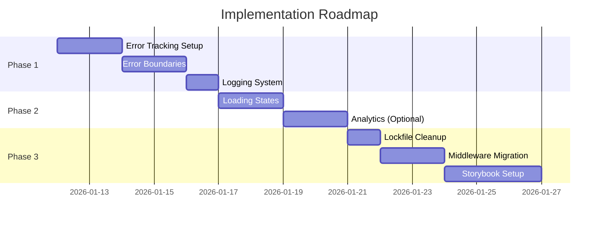

# Roadmap: Monitoring & Improvements
**Start Date:** 11 Januari 2026  
**Target Completion:** Q1 2026

---

## Timeline Overview



---

## Phase 1: Monitoring & Error Tracking (3-4 hari)

### Day 1-2: Error Tracking Setup
**Goal:** Setup Sentry atau alternatif untuk production error monitoring

**Tools to Research:**
1. **Sentry** (Recommended)
   - ✅ Free tier: 5K errors/month
   - ✅ Source map support
   - ✅ Performance monitoring
   - ✅ Next.js integration

2. **Vercel Analytics** (Alternative)
   - ✅ Native Vercel integration
   - ✅ Real User Monitoring (RUM)
   - ⚠️ Paid feature ($10/month)

3. **LogRocket** (Alternative)
   - ✅ Session replay
   - ✅ Console logs
   - ⚠️ More expensive

**Decision Criteria:**
- Budget: Prefer free tier
- Integration: Next.js compatibility
- Features: Error grouping, source maps, alerts

**Tasks:**
- [ ] Compare tools & make decision
- [ ] Create account & get DSN/API key
- [ ] Install SDK
- [ ] Configure for Next.js
- [ ] Test error reporting
- [ ] Setup alerts (Slack/Email)

---

### Day 3-4: Error Boundaries
**Goal:** Implement error boundaries untuk graceful error handling

**Components to Create:**
```
components/
├── error-boundary.tsx        # Reusable wrapper
└── error-fallback.tsx        # Fallback UI
```

**Coverage:**
- [ ] Root error boundary (`app/error.tsx`)
- [ ] Workspace error boundary (`app/(workspace)/error.tsx`)
- [ ] Component-level boundaries (untuk complex components)

**Testing:**
- Simulate errors dengan `throw new Error()`
- Verify fallback UI
- Test reset functionality
- Check error reporting ke monitoring

---

### Day 5: Logging System
**Goal:** Structured logging untuk debugging

**Files to Create:**
```typescript
// lib/monitoring/logger.ts
export const logger = {
  info: (message, context) => {},
  warn: (message, context) => {},
  error: (message, context) => {},
  debug: (message, context) => {}
};
```

**Integration Points:**
- API routes error handling
- Client-side error catching
- Supabase query errors
- External API failures

---

## Phase 2: Priority 3 Improvements (4-5 hari)

### Day 6-7: Loading States
**Goal:** Better UX dengan loading indicators

**Components:**
```
components/ui/
├── loading.tsx              # Generic loader
├── spinner.tsx              # Spinner variant
└── progress.tsx             # Progress bar
```

**Pages to Update:**
- [ ] Dashboard (`app/(workspace)/dashboard/page.tsx`)
- [ ] AI (`app/(workspace)/ai/page.tsx`)
- [ ] Automation (`app/(workspace)/automation/page.tsx`)
- [ ] Events (`app/(workspace)/events/page.tsx`)

**Pattern:**
```typescript
{isLoading ? <Spinner /> : <Content />}
```

---

### Day 8-9: Analytics (Optional)
**Goal:** Track user behavior untuk product insights

**Options:**
1. **Vercel Analytics**
   - Page views auto-tracked
   - Custom events

2. **Google Analytics 4**
   - Free
   - More detailed analytics

**Implementation:**
```typescript
// lib/analytics/index.ts
export const trackEvent = (name: string, props?: object) => {
  // GA4 or Vercel Analytics
};
```

**Events to Track:**
- Page views
- Button clicks (CTA)
- Form submissions
- AI interactions
- Document generations

---

## Phase 3: Priority 4 Nice-to-Haves (5-6 hari)

### Day 10: Lockfile Cleanup
**Goal:** Remove duplicate lockfile

**Steps:**
```bash
# Backup
cp package-lock.json package-lock.json.backup

# Remove
rm package-lock.json

# Update .gitignore
echo "package-lock.json" >> .gitignore

# Clean install dengan pnpm
pnpm install
```

**Verify:**
- Build succeeds
- Dev server works
- All dependencies resolved

---

### Day 11-12: Middleware → Proxy Migration
**Goal:** Migrate sesuai Next.js 16 recommendation

> [!WARNING]
> Breaking change - requires testing!

**Steps:**
1. Rename `middleware.ts` → `proxy.ts`
2. Update imports & exports
3. Test all protected routes
4. Test auth flow
5. Verify redirects

**Testing Checklist:**
- [ ] Login flow
- [ ] Protected route access
- [ ] Redirect from login when authenticated
- [ ] 401 on unauthenticated access
- [ ] Token validation

---

### Day 13-15: Storybook Setup
**Goal:** Component documentation & isolation

**Setup:**
```bash
npx storybook@latest init --type react
```

**Stories to Create:**
- [ ] Button variants
- [ ] Card layouts
- [ ] Form inputs
- [ ] Loading states
- [ ] Error boundaries

**Benefits:**
- Visual testing
- Component documentation
- Easier collaboration
- Design system reference

---

## Success Metrics

| Metric | Target | Tracking |
|--------|--------|----------|
| Error Detection Rate | 95% | Sentry dashboard |
| Error Resolution Time | < 24h | Sentry SLA |
| Page Load Time (P95) | < 3s | Vercel Analytics |
| User Session Length | > 5min | Analytics |
| Component Documentation | 100% | Storybook coverage |

---

## Risk Mitigation

| Risk | Impact | Mitigation |
|------|--------|------------|
| Sentry quota exceeded | High | Setup alerts at 80% quota |
| Middleware migration breaks auth | High | Extensive testing, rollback plan |
| Performance overhead from monitoring | Medium | Lazy load SDK, sample rate 10% |
| Storybook build size | Low | Separate build, not in production |

---

## Budget Estimate

| Item | Cost | Notes |
|------|------|-------|
| Sentry | Free | 5K errors/month |
| Vercel Analytics | $10/mo | Optional |
| LogRocket | $99/mo | Alternative, not recommended |
| Developer Time | 15 days | ~120 hours total |

**Recommended:** Use free tiers untuk proof of concept, upgrade later if needed.

---

## Next Steps After Completion

1. **Week 1 Post-Launch:**
   - Monitor error rates
   - Review Sentry issues
   - Fix critical bugs

2. **Week 2 Post-Launch:**
   - Analyze user behavior
   - Optimize slow pages
   - Improve error messages

3. **Month 1 Post-Launch:**
   - Review analytics insights
   - Plan feature improvements
   - Update Storybook

---

*Roadmap created: 2026-01-11*  
*Last updated: 2026-01-11*
